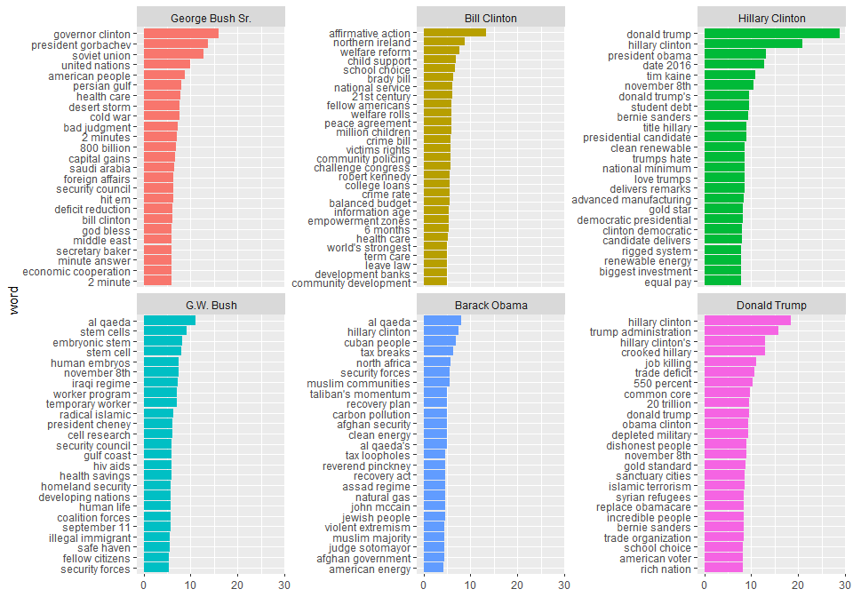

``` r
library(tidyverse)
library(tidytext)
library(tidylo)
```

Load and clean data to put speeches into tidy data format:

``` r
txt_files <- list.files(path = "data/speeches/", 
                        recursive = TRUE, 
                        full.names = TRUE)

speeches <- map_df(txt_files, ~ tibble(file = .x, line = readLines(.x))) %>%
    as_tibble() %>%
    mutate(president = str_extract(file, "[a-zA-Z]+(?=_)")) %>%
    relocate(president) %>%
    select(-file)
```

``` r
speeches <- speeches %>%
    mutate(president = fct_recode(president, 
        "George Bush Sr." = "bush",
        "Bill Clinton"    = "clinton",
        "Hillary Clinton" = "Clinton",
        "G.W. Bush"       = "gwbush",
        "Barack Obama"    = "obama",
        "Donald Trump"     = "Trump"
    ))

speeches <- speeches %>%
    filter(line != "") %>%
    mutate(start = str_extract(line, "<[A-Z ]+:")) %>%
    filter(start %in% c("<TRUMP:", "<CLINTON:", "<BUSH:", "<OBAMA:") | is.na(start)) %>%
    mutate(line = str_remove_all(line, '<[a-zA-Z=:\\"0-9,. ]+>')) %>%
    filter(! (president == "Donald Trump" & start == "<CLINTON:")) %>%
    filter(! (president == "Donald Trump" & start == "<OBAMA:")) %>%
    select(-start) %>%
    filter(line != "")
```

Here I use the tidylo (tidy log odds) package to add weighted log odds
for each word to each presidential candidate:

``` r
speeches_words <- speeches %>%
    unnest_tokens(word, line, token = "ngrams", n = 2) %>%
    separate(word, c("word1", "word2"), sep = " ") %>%
    filter(! word1 %in% stop_words$word) %>%
    filter(! word2 %in% stop_words$word) %>%
    unite(word, c("word1", "word2"), sep = " ")

speeches_words_log_odds <- speeches_words %>%
    count(president, word) %>%
    bind_log_odds(president, word, n) 
```

I plot the top 25 bigrams (two word phrases) that are most
characteristic of each speaker:

``` r
speeches_words_log_odds %>%
    group_by(president) %>%
    top_n(25, log_odds_weighted) %>%
    ungroup() %>%
    mutate(word = reorder_within(word, log_odds_weighted, president)) %>%
    ggplot(aes(log_odds_weighted, word, fill = president)) +
    geom_col() +
    facet_wrap(~president, scales = "free_y") +
    scale_y_reordered() +
    labs(x = NULL) +
    theme(legend.position = "none")
```


